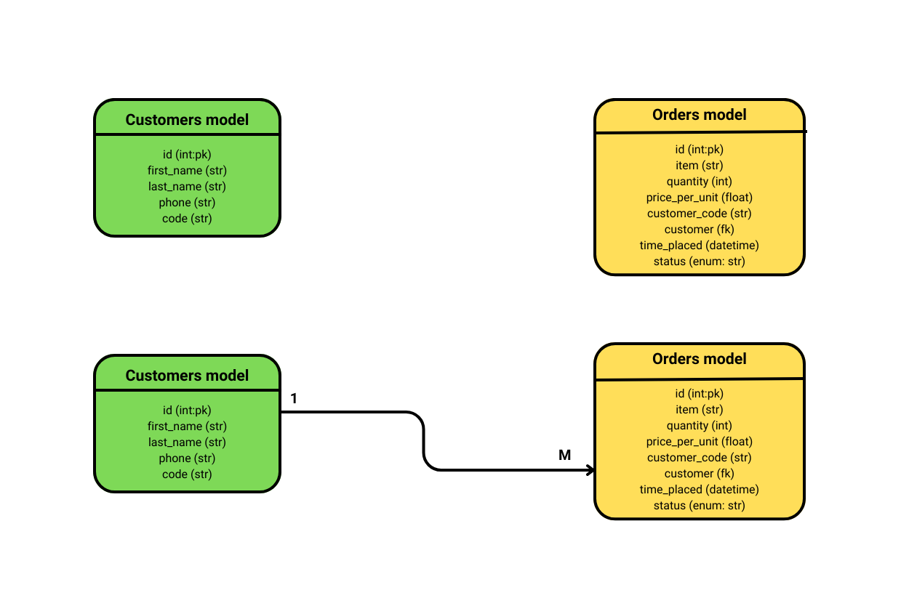

# SIMPLE REST API SERVICE

## Table of Contents
1. [Description](#description)
2. [Database models and design](#database-models-and-design)
    - [Customers](#customers-model)
    - [Models](#orders-model)
3. [REST API](#rest-api)
    - [Endpoints](#endpoints)
        - [API root](#api-root)
        - [Customers endpoint](#customers-endpoint)
        - [Orders endpoint](#orders-endpoint)
        - [Authentication endpoint](#authentication-endpoint)
        - [Documentation and Schema endpoint](#documentation-and-schema-endpoint)
4. [Authentication and Authorization](#authentication-endpoint)
5. [SMS Notifications](#sms-notifications)
6. [API Documentation](#api-documentation)
7. [Contributions and License](#contributions-and-license)

## 1. Description
This project is about building a Python REST API service with very minimalistic databases for customers and users. 
The REST API implementation uses the awesome [Django REST framework](https://www.django-rest-framework.org/ "The Django REST framework docs homepage"). It should support CRUD operations on the database models instances. 
Authentication and authorization of users is done using OpenID Connect.

## 2. Database Models and Design
 
 The underlying database server used for this service is PostgreSQL. The database models are designed to be very simple.

#### 2.1 Customers model
The customers have very few details.
- first_name: customer's first name.
- second_name: customer's second name.
- code: a 5-digit alphanumeric code unique to each customer.
- phone: customer's phone number, which is used for sending updates when an order is placed in their name. Phone number should be entered in international format, e.g. +254712345678
- id: autogenerated and used as the Primary Key.

#### 2.2 Orders model
Similarly the orders model is kept simple.
- item: name of the item to be bought. An order can only have one item in it.
- quantity: the number of units of the item being bought.
- price_per_unit: the price of each unit of the item.
- status: the status of the order. This is an enum with the following values; `Pending`, `Closed`, `Cancelled`. The default is `Pending`.
- customer_code: the code of the customer to whom the order belongs. The code is used internally for bookkeeping practices like relating an order to a customer.
- time_placed: hold the time the order was placed. It is autofilled when an order is created.
- customer: a Foreign Key that associates a specific customer to an order instance. The relationship between an order and a customer is many-to-one. Many orders can belong to a single customer.
- id: autogenrated and used as Primary Key

## 3. REST API
The API serive is built using [Django REST framework](https://www.django-rest-framework.org/ "The Django REST framework docs homepage"). 
The browsable API can be accessed [here](https://studious-couscous-c01a4bc36def.herokuapp.com/api/v1/ "Link to the browsable API"). 
For detailed description of supported HTTP methods, how to invoke them, and expected responses, check out the [`API docs`](#api-documentation). 

### 3.1 Endpoints
#### 3.1.1 Api root
- `/api/v1/`: the API root, has links to the customers and orders endpoints.
#### 3.1.2 Customers endpoint
- `/api/v1/customers/`: list all customer instances belonging to the user.
- `/api/v1/customers/`: create a new customer instance.
- `/api/v1/customers/<pk>/`: perform an action on the specified customer instance.
#### 3.1.3 Orders endpoint
- `/api/v1/orders/`: list all order instances belonging to the user.
- `/api/v1/orders/`: create a new order instance.
- `/api/v1/orders/<pk>/`: perform an action on the specified order instance 
#### 3.1.4 Authentication endpoint
- `/api/v1/api-auth/authenticate/`: login to the API using OpenID Connect and go to the home page.
- `/api/v1/api-auth/logout/`: logout from the API and return to the home page.
#### 3.1.5 Documentation and Schema endpoint
- `/api/v1/schema/`: view the schema.
- `/api/v1/docs/`: view the redoc.
- `/api/v1/swagger-docs/`: view the Swagger formatted docs.

## 4. Authentication and Authorization
[OpenID Connect](https://auth0.com/docs/authenticate/protocols/openid-connect-protocol#:~:text=OpenID%20Connect%20(OIDC)%20is%20an,to%20the%20OAuth%202.0%20specifications. "The OpenID Connect Protocol homepage") is used to provide authentication to API. The OpenID Connect provider used is [Google](https://developers.google.com/identity/openid-connect/openid-connect#python "The Google OpenID Connect specification page"). 
To implement this feature I used a third party library, [Mozilla OIDC](https://mozilla-django-oidc.readthedocs.io/en/stable/installation.html, "Mozilla OIDC docs homepage"), which makes the task remarkably easy. 
To enforce authorization, I used the `permission_classes` of Django REST to ensure only authenticated users can create, read, update or delete the models. 

## 5. SMS Notifications
When an order is placed, an SMS notification is sent to the related customer using the [Africa's Talking](https://africastalking.com/, "Africa's Talking Homepage") gateway. 
For testing purposes I am using the Sandbox app, therefore the message is not actually delivered to the customer. However, I save the gateway's response to a .txt file which can be examined to verify the message would have been delivered successfully.

## 6. API Documentation
This API's schema and documentation has been generated in accordance to the [OpenAPI](https://www.openapis.org/ "OpenAPI homepage") specifications. 
Please visit these links for in-depth details:
- [Redocs](https://studious-couscous-c01a4bc36def.herokuapp.com/api/v1/docs/ "API Redoc")
- [Swagger Docs](https://studious-couscous-c01a4bc36def.herokuapp.com/api/v1/swagger-docs/ "API Swagger docs")
- [API Schema](https://studious-couscous-c01a4bc36def.herokuapp.com/api/schema/ "API Schema")

## 7. Contributions and License
This work was done as part of the screening test for the backend developer role at Savannah Informatics, and is protected by the [MIT License](LICENSE "MIT License for the project"), all rights reserved. 

